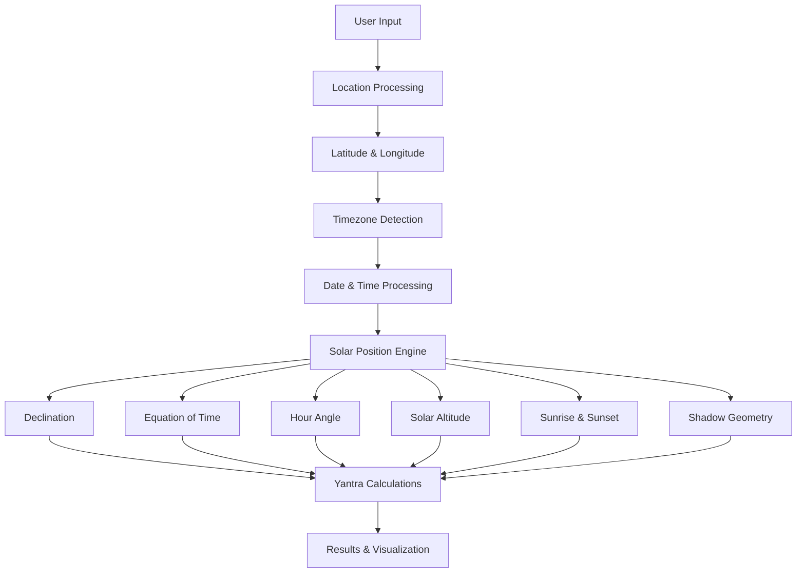
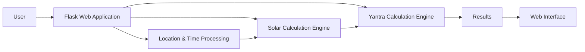

# ☀️ YantraSolar

### Astronomical Yantra & Solar Position Calculator

YantraSolar is a computational astronomy application that calculates **solar position, local solar time, sunrise and sunset, solar geometry, shadow length, and traditional Indian astronomical Yantra parameters** based on a selected location, date, and time.

The project connects **computational astronomy with traditional Indian astronomical instruments**, demonstrating how solar observations could be represented and calculated using historical Yantras.

---

## 📌 Overview

Traditional Indian astronomical instruments such as the **Samrat Yantra, Jai Prakash Yantra, Rama Yantra, and Rasivalaya Yantra** were designed to observe and determine astronomical parameters using the position and movement of celestial bodies.

YantraSolar brings these concepts into a modern computational environment.

The system accepts:

* 📍 Geographic location
* 📅 Date
* 🕐 Local time
* 🌍 Country/location information

and calculates relevant astronomical parameters using mathematical models.

---

## 🎯 Problem Statement

Traditional astronomical Yantras are difficult to understand and experiment with without physical instruments.

Students and researchers need a way to:

* Understand the relationship between the Sun and astronomical instruments
* Calculate solar parameters digitally
* Visualize solar geometry
* Explore the working principles of traditional Yantras
* Experiment with different locations and dates

---

## 💡 Our Solution

YantraSolar provides a digital platform that combines:

* Computational astronomy
* Solar-position calculations
* Geographic and timezone information
* Mathematical models
* Traditional Indian astronomical Yantras
* Interactive visualization

Users can select a location and time and obtain calculated solar parameters and corresponding Yantra measurements.

---

## ✨ Key Features

### ☀️ Solar Position Calculation

Calculate important solar parameters including:

* Solar declination
* Solar altitude
* Hour angle
* Local Solar Time
* Equation of Time
* Sunrise
* Sunset
* Shadow length

### 📍 Location-Based Calculations

The application supports location-based astronomical calculations using:

* Geocoding
* Latitude and longitude
* Timezone detection
* UTC offset
* Local solar calculations

### 🕰️ Local Solar Time

YantraSolar calculates Local Solar Time by considering:

* Standard local time
* Longitude
* Local Standard Meridian
* Equation of Time

### 🌅 Sunrise & Sunset

The system estimates:

* Sunrise time
* Sunset time
* Solar-day geometry
* Hour-angle based solar events

### 📐 Shadow Geometry

Shadow length is calculated from:

* Object height
* Solar altitude

This demonstrates the fundamental geometric principle behind several traditional solar instruments.

---

# 🏛️ Yantra Explorer

YantraSolar supports calculations related to multiple traditional Indian astronomical instruments.

### Supported Yantras

1. **Samrat Yantra**
2. **Jai Prakash Yantra**
3. **Rama Yantra**
4. **Digamsa Yantra**
5. **Dhruva-Protha-Chakra Yantra**
6. **Golayantra Chakra Yantra**
7. **Bhitti Yantra**
8. **Dakshinottara Bhitti Yantra**
9. **Rasivalaya Yantra**
10. **Nadi Valaya Yantra**
11. **Palaka Yantra**
12. **Chaapa Yantra**

Each Yantra represents different astronomical measurement concepts involving angles, time, solar position, or celestial coordinates.

---

## ⚙️ How It Works



---

# 🧮 Calculation Methodology

YantraSolar uses mathematical approximations for solar-position calculations.

### Day Number

The day number is determined from the selected date and used in subsequent solar calculations.

### Solar Declination

Solar declination is estimated using a standard sinusoidal approximation based on the day of the year.

### Equation of Time

The Equation of Time is calculated to account for the difference between apparent solar time and mean solar time.

### Hour Angle

The hour angle represents the angular displacement of the Sun from the local solar noon.

### Solar Altitude

Solar altitude is calculated using:

* Latitude
* Solar declination
* Hour angle

### Shadow Length

For an object of height `H`:

```text
Shadow Length = H / tan(Solar Altitude)
```

These calculations provide the mathematical foundation for the Yantra-related computations.

---

# 🏗️ System Architecture



---

# 🛠️ Tech Stack

## Backend

* **Python**
* **Flask**

## Scientific Computation

* Python `math`
* Mathematical solar-position formulas
* Custom astronomical calculation functions

## Location & Time

* **Geopy** – Location geocoding
* **TimezoneFinder** – Timezone identification
* **pytz** – Timezone and UTC offset handling

## Frontend

* HTML
* CSS
* JavaScript
* Flask Jinja Templates

## Development

* Git
* GitHub
* Python Virtual Environment

---

# 📂 Project Structure

```text
YantraSolar/
│
├── app.py
├── astro_utils.py
├── requirements.txt
├── README.md
│
├── templates/
│   └── index.html
│
├── static/
│   ├── css/
│   ├── js/
│   └── images/
│
└── .gitignore
```

---

# 🚀 Installation

## 1. Clone the Repository

```bash
git clone https://github.com/vasanth-1208/astro_computation.git
```

```bash
cd astro_computation
```

## 2. Create Virtual Environment

### Windows

```bash
python -m venv venv
```

Activate:

```bash
venv\Scripts\activate
```

### Linux / macOS

```bash
python3 -m venv venv
source venv/bin/activate
```

---

## 3. Install Dependencies

```bash
pip install -r requirements.txt
```

---

# ▶️ Running the Application

Start the Flask application:

```bash
python app.py
```

The application will start locally.

Open the local URL displayed by Flask in your browser.

---

# 📊 Application Workflow

```text
Enter Location
      ↓
Select Date & Time
      ↓
Geocode Location
      ↓
Determine Latitude & Longitude
      ↓
Determine Timezone
      ↓
Calculate Local Solar Time
      ↓
Calculate Solar Parameters
      ↓
Calculate Sunrise & Sunset
      ↓
Calculate Shadow Geometry
      ↓
Calculate Yantra Parameters
      ↓
Display Results
```

---

# 🌍 Example Use Case

A user enters:

```text
Location: Jaipur, India
Date: Selected Date
Time: Selected Local Time
```

YantraSolar processes the input and determines:

* Geographic coordinates
* Timezone
* Local Solar Time
* Solar declination
* Equation of Time
* Hour angle
* Solar altitude
* Sunrise
* Sunset
* Shadow geometry
* Yantra-related calculations

This allows users to explore how the Sun's position changes with **time and geographic location**.

---

# 🔬 Scientific Scope & Limitations

YantraSolar is primarily an **educational and computational astronomy project**.

The solar calculations use mathematical approximations rather than a full high-precision astronomical ephemeris system.

Therefore:

* Results should be considered approximate.
* The application is not intended for professional astronomical navigation.
* Atmospheric refraction and several advanced astronomical corrections may not be included.
* Accuracy can vary depending on location, date, and calculation model.

The project prioritizes **understanding astronomical principles and Yantra calculations** rather than claiming observatory-grade precision.

---

# 🔐 Security & Privacy

YantraSolar does not require users to provide sensitive personal information.

The application processes location and date/time inputs for astronomical calculations.

API keys, passwords, and other secrets should never be committed to the repository.

---

# 🧪 Testing

The project can be tested using different:

* Geographic locations
* Dates
* Times
* Latitude values
* Solar positions

Testing should include:

* Sunrise/sunset calculations
* Timezone conversion
* Solar altitude
* Shadow-length calculations
* Yantra calculation outputs
* Invalid location/date/time inputs

---

# 🔮 Future Enhancements

Future versions can include:

* 🌞 Interactive 3D Solar Position Visualization
* 🏛️ Interactive 3D Yantra models
* 🗺️ Interactive geographic map
* 📈 Solar position graphs
* 📊 Historical solar-data comparison
* 🕰️ Solar-time timeline
* 📱 Improved mobile interface
* 🔬 Higher-precision astronomical algorithms
* 🌌 Celestial coordinate visualization
* 📡 REST API for astronomical calculations
* 💾 Calculation history
* 📤 Export results as PDF/CSV
* 🛰️ Integration with astronomical ephemeris libraries

---

# 🌟 How Ancient Indian Astronomy Meets Computational Astronomy

YantraSolar demonstrates how historical astronomical knowledge can be explored using modern computational techniques.

Traditional astronomical instruments relied on:

* Geometry
* Angles
* Shadows
* Time measurement
* Celestial coordinates
* Solar movement

Modern computing allows these principles to be:

* Calculated mathematically
* Visualized digitally
* Tested across different locations
* Compared across different dates
* Presented through an interactive application

This makes YantraSolar a bridge between **historical astronomical knowledge and modern computational astronomy**.

---

# 📌 Project Status

**Active Development**

The project is being continuously improved with better visualization, astronomical calculations, user experience, and educational features.

---

# 👨‍💻 Author

**VASANTHARAJ M**

Computer Science & Engineering
Bannari Amman Institute of Technology

GitHub: `vasanth-1208`

---

## 📜 License

This project is intended for educational and research purposes.

Add an appropriate open-source license before distributing the project publicly.
